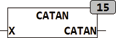

<!--
  Copyright (c) 2026 Hans Mühlbauer, Franz Höpfinger and others.

  This program and the accompanying materials are made available under the
  terms of the Eclipse Public License 2.0 which is available at
  https://www.eclipse.org/legal/epl-2.0

  SPDX-License-Identifier: EPL-2.0
-->

## CATAN

| | |
|:---|:---|
| **Type	Function** | COMPLEX |
| **Input	X** | COMPLEX  (Input) |
| **Output** | COMPLEX (result) |
| | ATAN calculates the arc tangent of a complex number |
| | The range of values of the result is between [-/2,+/2 ] For the imaginary part. |

