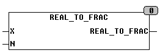

<!--
  Copyright (c) 2026 Hans Mühlbauer, Franz Höpfinger and others.

  This program and the accompanying materials are made available under the
  terms of the Eclipse Public License 2.0 which is available at
  https://www.eclipse.org/legal/epl-2.0

  SPDX-License-Identifier: EPL-2.0
-->

## REAL_TO_FRAC

| | |
|:---|:---|
| **Type	Function** | FRACTION |
| **Input	X** | REAL (input) |
| **N** | INT (maximum value of the denominator) |
| **Output** | FRACTION (output value) |
| | REAL_TO_FRAC converts a floating point number (REAL) in a fraction. The function returns the data type is a FRACTION of the structure with 2 values. With the input X, the maximum size of the counter can be specified. |
| **Data type FRACTION** |  |
| ***.NUMERATOR** | INT	(Numerator of the fraction) |
| ***.DENOMINATOR** | INT	(Denominator of the fraction) |

**Beispiel:**

Example: REAL_TO_FRAC(3.1415926, 1000) results 355 / 113. 355/133 gives the best approximation for the denominator  < 1000
