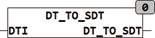

<!--
  Copyright (c) 2026 Hans Mühlbauer, Franz Höpfinger and others.

  This program and the accompanying materials are made available under the
  terms of the Eclipse Public License 2.0 which is available at
  https://www.eclipse.org/legal/epl-2.0

  SPDX-License-Identifier: EPL-2.0
-->

## Type	Function: SDT

| | |
|:---|:---|
| **Input	DTI** | DT (date time value) |
| **Output** | SDT (Structured date time value of type SDT) |
| | DT_TO_SDT converts a date value into a structured date day of type SDT. |

