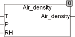

<!--
  Copyright (c) 2026 Hans Mühlbauer, Franz Höpfinger and others.

  This program and the accompanying materials are made available under the
  terms of the Eclipse Public License 2.0 which is available at
  https://www.eclipse.org/legal/epl-2.0

  SPDX-License-Identifier: EPL-2.0
-->

## Type	 Function  : REAL

| | |
|:---|:---|
| **Input	T** | REAL (air temperature in ° C) |
| **P** | REAL (air pressure in Pascal) |
| **RH** | REAL (humidity in %) |
| **Output** | (Density of air in kg / m³) |
| | AIR_DENSITY calculates the density of air in kg / m³ depending on pressure, humidity and temperature. The temperature is given in ° C, pressure in Pascal and the humidity in % (50 = 50%). |

