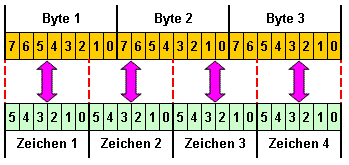

<!--
  Copyright (c) 2026 Hans Mühlbauer, Franz Höpfinger and others.

  This program and the accompanying materials are made available under the
  terms of the Eclipse Public License 2.0 which is available at
  https://www.eclipse.org/legal/epl-2.0

  SPDX-License-Identifier: EPL-2.0
-->

## The BASE64 encoding is a process for Encoding of 8-bit binary data into a string consisting of only 64   globally available ASCII characters. Application is HTTP Basic Authentication, PGP signatures and keys, and MIME encoding for e-mail. To enable the SMTP protocol as the easy transport of binary data, a conversion is necessary, as foreseen in the original version, only 7-bit ASCII characters.

When encoding always three bytes of byte stream (24 bit) are devided in 6-bit blocks. Each of these 6-bit blocks results in a number between 0 and 63. This results in the following 64 printable ASCII characters [A-Z] [a-z] [0-9], [+/]. The encoding increases the space requirements of the data stream by 33%, from 3 characters each  to 4 characters each. If the length of the coding is not divisible by 4, filler characters will be appended at the end. In this case the sign "=" is used .

