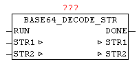

<!--
  Copyright (c) 2026 Hans Mühlbauer, Franz Höpfinger and others.

  This program and the accompanying materials are made available under the
  terms of the Eclipse Public License 2.0 which is available at
  https://www.eclipse.org/legal/epl-2.0

  SPDX-License-Identifier: EPL-2.0
-->

## BASE64_DECODE_STR

| | |
|:---|:---|
| **Type** | Function module |
| **Input	RUN** | BOOL (positive edge starts conversion) |
| **Output	DONE** | BOOL (TRUE if conversion is completed) |
| **I / O	STR1** | STRING(192) (text in BASE64 format) |
| **STR2** | STRING(144) (converted normal text) |
| | With a BASE64_DECODE_STR encoded in BASE64 text can be converted back to plain text. With a positive edge of RUN the process starts. Here DONE is immediately reseted, if it has been set by a previous conversion. The BASE64 encoded text is passed on STR1, and after the conversion the plain text is available in STR2, and DONE is set to TRUE. |

**Beispiel:**

Example: Text in STR1 'T3BlbiBTb3VyY2UgQ29tbXVuaXR5IGZvciBBdXRvbWF0aW9uIFRlY2hub2xvZ3k=' Result in STR2 Text in STR2 = 'Open Source Community for Automation Technology'
