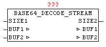

<!--
  Copyright (c) 2026 Hans Mühlbauer, Franz Höpfinger and others.

  This program and the accompanying materials are made available under the
  terms of the Eclipse Public License 2.0 which is available at
  https://www.eclipse.org/legal/epl-2.0

  SPDX-License-Identifier: EPL-2.0
-->

## Type	Function module

| | |
|:---|:---|
| **Input	SIZE1** | INT (number of bytes in the BUF1 for decode) |
| **Output	SIZE2** | INT (number of bytes in BUF2 of the decoded results) |
| **I / O	BUF1** | ARRAY [0..63] OF BYTES (BASE64 data for conversion) |
| **BUF2** | ARRAY [0..47] OF BYTES (converted data) |
| | With BASE64_DECODE_STREAM arbitrarily long BASE64 byte streams are decoded. In one pass, up to 64 bytes are decoded, which in turn emerged from a maximum of 48 bytes each. Here, the source data is passed to the decoder over BUF1 in the data-stream manner as individual blocks of data, and in decoded form re-issued in BUF2. The user has to provide the further processing of the BUF2 data before the next block of data is converted. The number of bytes in BUF2 is issued by SIZE2 from the module. |

