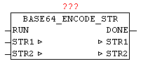

<!--
  Copyright (c) 2026 Hans Mühlbauer, Franz Höpfinger and others.

  This program and the accompanying materials are made available under the
  terms of the Eclipse Public License 2.0 which is available at
  https://www.eclipse.org/legal/epl-2.0

  SPDX-License-Identifier: EPL-2.0
-->

## BASE64_ENCODE_STR

| | |
|:---|:---|
| **Type** | Function module |
| **Input	RUN** | BOOL (positive edge starts conversion) |
| **Output	DONE** | BOOL (TRUE if conversion is completed) |
| **I / O	STR1** | STRING (144) (Text to convert) |
| **STR2** | STRING (192) (converted text in BASE64 format) |
| | With BASE64_ENCODE_STR a standard text can be converted to a BASE64 encoded text. With a positive edge of RUN the process starts. Here DONE is immediately reseted, if it has been set by a previous conversion. The BASE64 encoded text is passed on STR1, and after the conversion the BASE64 text is available in STR2, and DONE is set to TRUE. |

**Beispiel:**

Example: Text in STR1 = 'Open Source Community for Automation Technology' Result in STR2 'T3BlbiBTb3VyY2UgQ29tbXVuaXR5IGZvciBBdXRvbWF0aW9uIFRlY2hub2xvZ3k='
