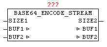

<!--
  Copyright (c) 2026 Hans Mühlbauer, Franz Höpfinger and others.

  This program and the accompanying materials are made available under the
  terms of the Eclipse Public License 2.0 which is available at
  https://www.eclipse.org/legal/epl-2.0

  SPDX-License-Identifier: EPL-2.0
-->

## Type	Function module

| | |
|:---|:---|
| **Input	SIZE1** | INT (number of bytes in the BUF1 to encode) |
| **Output	SIZE2** | INT (number of bytes in the encoded BUF2 results) |
| **I / O	BUF1** | ARRAY [0..47] OF BYTES (data to convert) |
| **BUF2** | ARRAY [0..63] OF BYTES (BASE64 converted data) |
| | With BASE64_ENCODE_STREAM arbitrarily long byte data stream according to   BASE64 can be encoded. In one pass, up to 48 bytes are converted, in turn, result more than 64 bytes. Here, the source data is passed to the encoder over BUF1 in the data-stream manner as individual blocks of data, and in coded form re-issued in BUF2. The user has to provide the further processing of the BUF2 data before the next block of data is converted. The number of bytes in BUF2 is issued by SIZE2 from the module. |

