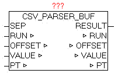

<!--
  Copyright (c) 2026 Hans Mühlbauer, Franz Höpfinger and others.

  This program and the accompanying materials are made available under the
  terms of the Eclipse Public License 2.0 which is available at
  https://www.eclipse.org/legal/epl-2.0

  SPDX-License-Identifier: EPL-2.0
-->

## CSV_PARSER_BUF

| | |
|:---|:---|
| **Type** | Function module |
| **IN_OUT	SEP** | BYTE (devider) |
| **RUN** | BYTE (command code for current action) |
| **OFFSET** | UDINT (current file offset of the query) |
| **VALUE** | STRING (STRING_LENGTH)  (value of a key) |
| **PT** | NETWORK_BUFFER (read data buffer) |
| **OUTPUT** | RESULT: BYTE (result of query) |
| | The module CSV_PARSER_BUF enables the analysis of the elements contained in the buffer. The number of data contained on   PT.SIZE specified. The separator is specified in parameter "SEP". The search for elements that always begins, depending on the given "OFFSET", so it is very easy to look at certain points in order to not always have to search the entire buffer. At the beginning should be started with by default the OFFSET 0 (but need not). |
| | At the beginning of the default should be started OFFSET 0 (but need not). Of course this is dependent on the content or the structure of the data. |
| **Evaluate elements** |  |
| | Will specify in SEP 0, lines are always evaluated completely and parameter "VALUE" is issued. If the elements in the buffer are structured as CSV (Excel), so at SEP the separator ',' or something else can be specified. RUN = 1  startes  the evaluation. Since it is not foreseeable how long the search takes, a watchdog function is Integrated that stops the search for the current cycle, then RESULT = 5 and RUN remains unchanged. In the next cycle, the analysis proceeds automatically. As soon as the next element is detected, the element in VALUE is passed, and RESULT is 1. If the element is also the last in a line, then RESULT = 2 is the output. As soon as the end of the data has been reached at RESULT = 10 passed. Always if yet RUN = 0 is output, RESULT defines the result. If an item is longer than the maximum length (string_length) so the characters are cut off automatically. The parameter OFFSET is by the module automatically passed after each result, but can be defined individually before each evaluation. |

**Beispiel:**

Example 1 Analyze data by lines: Zeile 1<CR,LF>
Line 2<CR,LF> Default: offset 0, SEP = 0 and RUN = 1 
VALUE = 'Line 1', RUN = 0, RESULT = 2 
Default: RUN = 1 
VALUE = 'line 2', RUN = 0, RESULT = 2
RUN set back to 1 
VALUE = '', RUN = 0 , RESULT = 10 Example 2 Analyze data as individual elements: 10,20<CR,LF>
a,b<CR,LF> Offset 0 , SEP = ',' und RUN = 1
VALUE = '10', RUN = 0 , RESULT = 1
RUN set back to 1 
VALUE = '20', RUN = 0 , RESULT = 2
RUN set back to 1 
VALUE = 'a', RUN = 0 , RESULT = 1
RUN set back to 1 
VALUE = 'b', RUN = 0 , RESULT = 2
RUN set back to 1 
VALUE = '', RUN = 0 , RESULT = 10 RUN: Feature List RESULT: Result - Feedback

| RUN | Function |
| --- | --- |
| 0 | No function to perform - and last function is complete |
| 1 | Element to evaluate |

| RESULT | Description |
| --- | --- |
| 1 | Element found |
| 2 | Element and the end of the line identified |
| 5 | Current query is still running - call module further cyclical! |
| 10 | Nothing found - reached the end of data |
