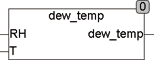

<!--
  Copyright (c) 2026 Hans Mühlbauer, Franz Höpfinger and others.

  This program and the accompanying materials are made available under the
  terms of the Eclipse Public License 2.0 which is available at
  https://www.eclipse.org/legal/epl-2.0

  SPDX-License-Identifier: EPL-2.0
-->

## Type	 Function  : REAL

| | |
|:---|:---|
| **Input	RH** | REAL (Relative Humidity) |
| **T** | REAL (temperature in °C) |
| **Output** | REAL (dew point) |
| | The module DEW_TEMP calculate the dew point temperature from the relative humidity (RH) and temperature (T in ° C). The relative humidity is given in %   (50 = 50%). |

