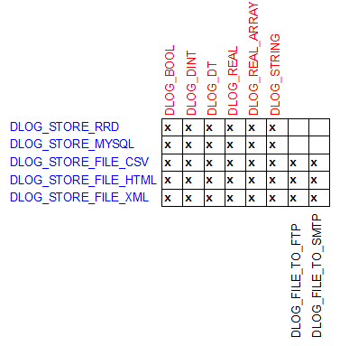
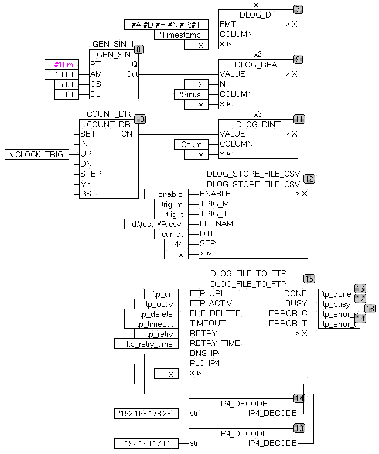

<!--
  Copyright (c) 2026 Hans Mühlbauer, Franz Höpfinger and others.

  This program and the accompanying materials are made available under the
  terms of the Eclipse Public License 2.0 which is available at
  https://www.eclipse.org/legal/epl-2.0

  SPDX-License-Identifier: EPL-2.0
-->

## DATA-LOGGER

The data logger modules enable the collection and storage of process data in real time. After triggering the storage pulse all parameterized process values are stored in a data buffer, as  various storage media are often not fast enough. Up to 255 process values are processed in one package. The calling order of the modules determines  automatically the ranking of the process values (take care of data-flow order) Fore storing the various data types, the following modules are provided. DLOG_STRING DLOG_REAL DLOG_DINT DLOG_DT DLOG_BOOL Other data types convert first manually, and transferred as STRING. The collected data can then be forwarded to a data target. DLOG_STORE_FILE_CSV 	store data as csv-file DLOG_STORE_FILE_HTML 	store data as HTML-file DLOG_STORE_FILE_XML 	store data as XML-file DLOG_STORE_RRD 		store data on RRD-server The files that are stored on the controller can then be forwarded to external data targets. DLOG_FILE_TO_SMTP (File as Email) DLOG_FILE_TO_FTP (copy file to an external FTP server) The modules above can be combined with each other. The following example shows the recording of a time stamp,  a REAL and DINT counter. Here, the process data is stored after each minute in a new CSV formatted file. Once a file is ready, it will be moved automatically to an FTP server.

