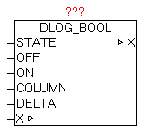

<!--
  Copyright (c) 2026 Hans Mühlbauer, Franz Höpfinger and others.

  This program and the accompanying materials are made available under the
  terms of the Eclipse Public License 2.0 which is available at
  https://www.eclipse.org/legal/epl-2.0

  SPDX-License-Identifier: EPL-2.0
-->

## DLOG_BOOL

| | |
|:---|:---|
| **Type	Function module** |  |
| **IN_OUT	X** | DLOG_DATA (DLOG data structure) |
| **INPUT	STATE** | BOOL (process value TRUE / FALSE) |
| **ON** | STRING (text for the TRUE state) |
| **OFF** | STRING (text for state FALSE) |
| **COLUMN** | STRING (40) (process value name) |
| **DELTA** | DINT (difference value) |
| | The module DLOG_BOOL is for logging (recording) of a process value of type BOOL, and can only be used in combination with a DLOG_STORE_* module, as this coordinates of the data structure X to record the data. At recording formats that support a process value name, such as at DLOG_STORE_FILE_CSV a name can be provided at COLUMN". Depending on the state of the STATE the TEXT of parameter OFF or ON is used. If with DELTA parameter a TRUE is specified, the automatic data logging is enabled via differential monitoring. By changing the state of STATE   automatically a record is stored. This feature can be applied in parallel to the central trigger on the DLOG_STORE_ * module. |

