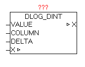

<!--
  Copyright (c) 2026 Hans Mühlbauer, Franz Höpfinger and others.

  This program and the accompanying materials are made available under the
  terms of the Eclipse Public License 2.0 which is available at
  https://www.eclipse.org/legal/epl-2.0

  SPDX-License-Identifier: EPL-2.0
-->

## DLOG_DINT

| | |
|:---|:---|
| **Type	Function module** |  |
| **IN_OUT	X** | DLOG_DATA (DLOG data structure) |
| **INPUT	VALUE** | DINT (process value) |
| **COLUMN** | STRING (40) (process value name) |
| **DELTA** | DINT (difference value) |
| | The block DLOG_DINT is for logging (recording) of a process value of type DINT, and can only be used in combination with a DLOG_STORE_* module, as this coordinates of the data structure X to record the data. At recording formats that support a process value name, such as at DLOG_STORE_FILE_CSV a name can be provided at COLUMN". If with DELTA parameter a value not equal 0 is specified, the automatic data logging is enabled via differential monitoring. Changing the value of VALUE to + / - DELTA automatically stores a record. This feature can be applied in parallel to the central trigger on the DLOG_STORE_ * module. |

