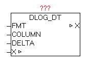

<!--
  Copyright (c) 2026 Hans Mühlbauer, Franz Höpfinger and others.

  This program and the accompanying materials are made available under the
  terms of the Eclipse Public License 2.0 which is available at
  https://www.eclipse.org/legal/epl-2.0

  SPDX-License-Identifier: EPL-2.0
-->

## DLOG_DT

| | |
|:---|:---|
| **Type	Function module** |  |
| **IN_OUT	X** | DLOG_DATA (DLOG data structure) |
| **INPUT	FMT** | STRING (formatting parameters) |
| **COLUMN** | STRING (40) (process value name) |
| **DELTA** | UDINT (difference in seconds) |
| **The module DLOG_DT is for logging (recording) of a date or time value of type STRING, and can only be used in combination with a DLOG_STORE_* module, as this coordinates the record the data by the data structure X. Using FMT parameter, the formatting will be set. In the FMT parameter can also be combined with normal text formatting parameters. See documentation on the block DT_TO_STRF. If the FMT parameter is not specified, the default formatting
'#A-#D-#H #N** | #R:#T' is used. |

| | At recording formats that support a process value name, such as at DLOG_STORE_FILE_CSV a name can be provided at COLUMN". |
| | If with DELTA parameter a value greater than 0 is specified, the automatic data logging is enabled via differential monitoring. If time changes by the value of DELTA automatically a record is stored. This feature can be applied in parallel to the central trigger on the DLOG_STORE_ * module. If, for example DELTA is the value 30, automatically every 30 seconds a record is saved. |

**Beispiel:**

Example: FMT := '#A-#D-#H-#N:#R:#T' resuls '2011-12-22-06:12:50'
