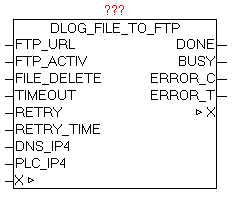

<!--
  Copyright (c) 2026 Hans Mühlbauer, Franz Höpfinger and others.

  This program and the accompanying materials are made available under the
  terms of the Eclipse Public License 2.0 which is available at
  https://www.eclipse.org/legal/epl-2.0

  SPDX-License-Identifier: EPL-2.0
-->

## DLOG_FILE_TO_FTP

| | |
|:---|:---|
| **Type	Function module** |  |
| **IN_OUT	X** | DLOG_DATA (DLOG data structure) |
| **INPUT	FTP_URL** | STRING(STRING_LENGTH) (FTP access path) |
| **FTP_ACTIV** | BOOL (PASSIV = 0 / ACTIV = 1) |
| **FILE_DELETE** | BOOL (delete files after transfer) |
| **TIMEOUT** | TIME (time) |
| **RETRY** | INT (number of repetitions) |
| **RETRY_TIME** | TIME (waiting period before repetition) |
| **Dns_ip4** | DWORD (IP4 address of the DNS server) |
| **Dns_ip4** | DWORD (IP4 address of the DNS server) |
| **OUTPUT	DONE** | BOOL   (Transfer completed without error) |
| **BUSY** | BOOL   (Transfer active) |
| **ERROR_C** | DWORD   (Error code) |
| **ERROR_T** | BYTE   (Problem type) |
| **The module DLOG_FILE_TO_FTP is used to automatically transfer the by DLOG_STORE_FILE_CSV generated from files to an FTP-server. The FTP_URL parameter contains the name of the FTP server and optionally the user name and password, an access path and an additional port number for the data channel. If no Username or password is transferred, the device automatically tries to register as "Anonymous". The parameter FTP_ACTIV determined whether the FTP server is operated in active or passive mode. In the ACTIV mode, the FTP server tries to establish the data channel for control, however these may cause problems by security software, firewall, etc.  because it could block the connection request. For this purpose, in the firewall a corresponding exception rule has to be defined. In the passive mode, this problem is alleviated since the controller establishes the connection, and can easily pass through the firewall. The control channel is always set up on port 20, and the data channel via standard PORT21, but this is in turn is depending whether active or passive mode is used, or optional   PORT number in the FTP-URL is specified. With the parameter FILE_DELETE can be determined whether the source file should be deleted after successful transfer. This works on FTP and even on the control side. In specifying  FTP directories the behavior depends on FTP server, whether they exist in this case  or are created automatically. Normally, these should be already available. The size of files is no limit per se, but there are practical limits** | Space on PLC, FTP storage and the transmission time. With dns_ip4 the IP address of the DNS server must be specified, if in the FTP URL a DNS name is given, alternatively, an IP address can be entered in the FTP URL. At parameters PLC_IP4 the own IP addresses has to be supplied. If errors occur during transmission these are passed to the output ERROR_C and ERROR_T. As long as the transfer is running, BUSY = TRUE, and after an error-free completion of the operation, DONE = TRUE. Once a new transfer is started, DONE,  ERROR_T and ERROR_C are reseted. |
| | If parameter RETRY = 0, then the FTP transfer was repeated until it completes successfully. If RETRY state at a value > 0, the FTP transfer is just as often repeated in transmission failure. Then this job is simply discarded and the process continues with the next file. With RETRY-TIME the waiting time between the repetitions can be defined. |
| | The module has integrated the IP_CONTROL and must not be externally linked to this, as it by default  would be necessary. |
| **Background** | http://de.wikipedia.org/wiki/File_Transfer_Protocol |
| **URL examples** |  |
| **ftp** | //username:password@servername:portnummer/directory/ |
| **ftp** | //username:password@servername |
| **ftp** | //username:password @ servername / directory / |
| **ftp** | //servername |
| **ftp** | //username:password@192.168.1.1/directory/ |
| **ftp** | //192.168.1.1 |
| **ERROR_T** |  |

| Value | Properties |
| --- | --- |
| 1 | Problem: DNS_CLIENTThe exact meaning of ERROR_C can be read at module DNS_CLIENT |
| 2 | Problem: FTP control channelThe exact meaning of ERROR_C can be read at module IP_CONTROL |
| 3 | Problem: FTP data channelThe exact meaning of ERROR_C can be read at module IP_CONTROL |
| 4 | Problem: FILE_SERVERThe exact meaning of ERROR_C can be read at block FILE_SERVER |
| 5 | Problem: END - TIMEOUTERROR_C  contains the left WORD of the step number, and the right WORD has the response code received by the FTP server.The parameters must be considered first as a HEX value, divided into two WORDS, and then be considered as a decimal value.Example:ERROR_T = 5ERROR_C = 0x0028_00DCEnd-step number 0x0028 = 40Response-Code 0x00DC = 220 |
