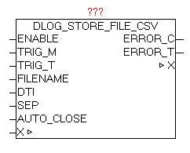

<!--
  Copyright (c) 2026 Hans Mühlbauer, Franz Höpfinger and others.

  This program and the accompanying materials are made available under the
  terms of the Eclipse Public License 2.0 which is available at
  https://www.eclipse.org/legal/epl-2.0

  SPDX-License-Identifier: EPL-2.0
-->

## DLOG_STORE_FILE_CSV

| | |
|:---|:---|
| **Type	Function module** |  |
| **IN_OUT	X** | DLOG_DATA (DLOG data structure) |
| **INPUT	ENABLE** | BOOL (release data recording) |
| **TRIG_M** | BOOL (manual trigger) |
| **TRIG_T** | UDINT (automatic trigger over time) |
| **FILE NAME** | STRING (file name) |
| **DTI** | DT (Current DATE-TIME value) |
| **SEP** | BYTE (separator of the recorded elements) |
| **OUTPUT	ERROR_C** | DWORD   (Error code) |
| **ERROR_T** | BYTE   (Problem type) |
| | The module DLOG_STORE_FILE_CSV is for logging (recording) of the process values in a CSV formatted file. The data can be passed with the modules DLOG_DINT, DLOG_REAL, DLOG_STRING, DLOG_DT. The parameter TRIG_M (positive pulse) is used to manually trigger (start) the storage of process data. With Parameters TRIG_T  an automatic time-controlled release can be realized. If the current date / time value divided by the parameterized TRIG_T value with residual value is 0, then a Save is performed. 
This also ensures that the store is always performed at the same time |

**Beispiel:**

Examples: TRIG_T = 60 every 60 sec at each new minute in second 0 a store is performed. TRIG_T = 10 In second  0,10,20,30,40,50 a store is performed. TRIG_T = 3600 At after each new hour at minute 0 and second 0 a store is performed. The triggers TRIG_T and TRIG_M can be used in parallel independent of each other. With parameters FILENAME the file name (including path if necessary) is defined. If the filename is changed during the recprding, it will automatically on-the-fly changed to the new record file (with no data loss). This change can also be automated. The parameter FILE NAME supports the use of date / time parameter (see documentation from the module DT_TO_STRF) Example: FILE NAME = 'Station_01_#R.csv' At position of '#R' automatically the current minute number is entered. This means that automatically every minute the file name changes, and therefore the data is written into the file. Thus, within an entire hour 60 files are created and filled with data, and in the ring buffer manner overwritten again and again. A recording can be done automatically and creates every day, week, month, etc. a new file as desired. If a new FILE NAME is detected, a possibly existing file is erased and rewritten. On DTI parameters, the current date / time value has to be transferred. In SEP the ASCII code of the delimiter is given. CSV file format: See:	http://de.wikipedia.org/wiki/CSV_(Dateiformat) Example of a CSV delimited file ';' and column headings Date / Time;Z1;Z2;seconds 2010-10-22-06:00:00;1;2;00 2010-10-22-06:00:06;1;2;06 2010-10-22-06:00:12;1;2;12 2010-10-22-06:00:18;1;2;18 ERROR_T:

| Value | Properties |
| --- | --- |
| 1 | Problem: FILE_SERVERThe exact meaning of ERROR_C can be read at block FILE_SERVER |
