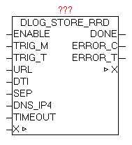
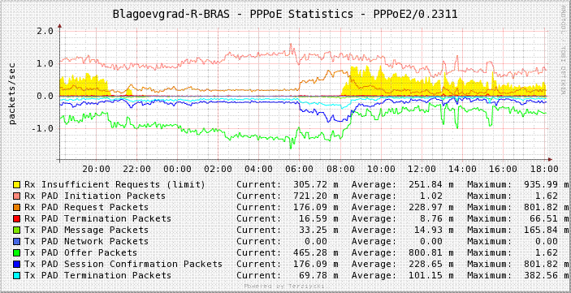
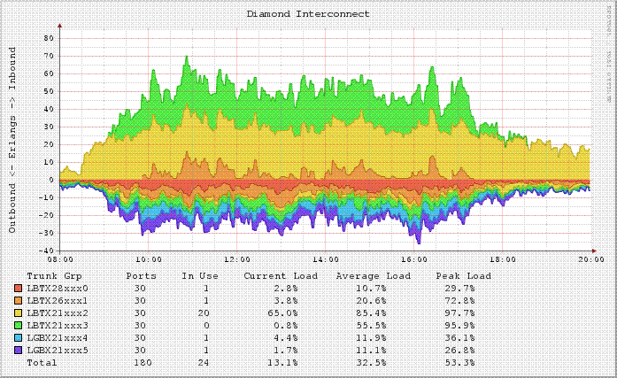
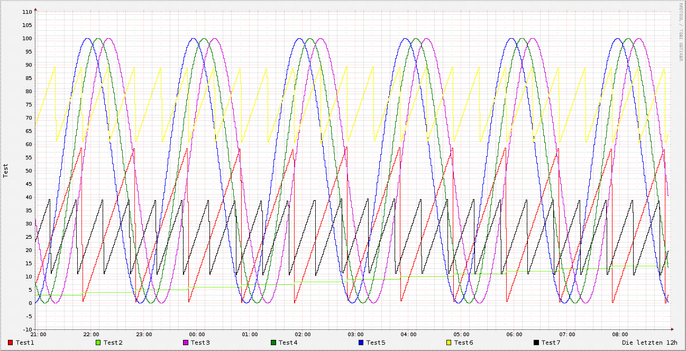

<!--
  Copyright (c) 2026 Hans Mühlbauer, Franz Höpfinger and others.

  This program and the accompanying materials are made available under the
  terms of the Eclipse Public License 2.0 which is available at
  https://www.eclipse.org/legal/epl-2.0

  SPDX-License-Identifier: EPL-2.0
-->

## DLOG_STORE_RRD

| | |
|:---|:---|
| **Type	Function module** |  |
| **IN_OUT	X** | DLOG_DATA (DLOG data structure) |
| **INPUT** | ENABLE BOOL (Enable data recording) |
| **TRIG_M** | BOOL (manual trigger) |
| **TRIG_T** | UDINT (automatic trigger over time) |
| **URL** | STRING(string_length) (URL address of the server) |
| **DTI** | DT (Current DATE-TIME value) |
| **SEP** | BYTE (separator of the recorded elements) |
| **Dns_ip4** | DWORD (IP address of the DNS server) |
| **TIMEOUT** | TIME (monitoring time) |
| **OUTPUT	DONE** | BOOL   (Data transfer completed without error) |
| **ERROR_C** | DWORD   (Error code) |
| **ERROR_T** | BYTE   (Problem type) |
| | The module DLOG_STORE_RRD serves for logging (recording) of the process values in an RRD database. The data can be passed with the modules DLOG_DINT, DLOG_REAL, DLOG_STRING, DLOG_DT. The parameter TRIG_M (positive pulse) is used to manually trigger (start) the storage of process data. With Parameters TRIG_T  an automatic time-controlled release can be realized. If the current date / time value divided by the parameterized TRIG_T value with residual value is 0, then a Save is performed. 
This also ensures that the store is always performed at the same time |

**Beispiel:**

Examples: TRIG_T = 60 every 60 sec at each new minute in second 0 a store is performed. TRIG_T = 10 In second  0,10,20,30,40,50 a store is performed. TRIG_T = 3600 At after each new hour at minute 0 and second 0 a store is performed. The triggers TRIG_T and TRIG_M can be used in parallel independent of each other. On DTI parameters, the current date / time value has to be transferred. In SEP the ASCII code of the delimiter is given. If an error occurs during the query it is reported in ERROR_C in combination with ERROR_T. ERROR_T: With the parameter URL, the access path and the php-script-call is passed. An example URL: http://my_servername/myhouse/rrd/test_rrd.php?rrd_db=test.rrd&value= DNS server or IP address Access path and name of the php-script php-script parameter 1 = Database Name php-script parameter 2 = Process values The module automatically copies all process values behind "&value=" so that then the following data (example) used http://my_servername/myhouse/rrd/test_rrd.php?rrd_db=test.rrd&value=10:20:30:40:50:60:70 The individual process data are, using the parameter SEP (separator), separated from each other. It is important that the passed URL string and the process data are not longer than 250 characters. The structure of the URL is only an example, and can in principle be designed with own free server applications and scripts in conjunction with their. What are the possibilities for and benefits rrdtool rrdtool is a program that saves the time-related measurement data, and summarizes and visualizes the data. The program was originally developed by Tobias Oetiker and under the GNU General  Public License  (GPL). By publishing a free software now many other authors new functionality and bug fixes have contributed. rrdtool is available as source code and an executable program for many operating systems. Source:  http://de.wikipedia.org/wiki/RRDtool Sample graphs: Source -  http://www.mrtg.org/ What is required: hardware, software, tools, etc. PLC with Network OSCAT-lib A power-saving PC for the duration of operation (24/7). On the PC, rrdtol and the php scripts are installed. The scripts have been developed on a Linux-Xubuntu-PC  with PHP. Quick Start: The demo program in conjunction with the demo php scripts create the following data or graphic. Links http://www.mrtg.org/rrdtool/ http://de.wikipedia.org/wiki/RRDtool http://www.rrze.uni-erlangen.de/dienste/arbeiten-rechnen/linux/howtos/rrdtool.shtml http://arbeitsplatzvernichtung-durch-outsourcing.de/marty44/rrdtool.html php-script - Examples / Templates create_test_rrddb.php #!/etc/php5/cli -q <?php error_reporting(E_ALL); # ================================== # Creates a rrd database # Is called once from the console # 12/11/2010 by NetFritz # ================================== # Create wp.rrd creates the database test.rrd # - Step 60 all 60 sec, a value is expected # DS:t1:GAUGE:120:0:100 a data source named t1 is created #  the type is gauge. It is waiting  120sec  for new data, if not, #   the data is written into the database as UNKNOWN. #   the minimum and maximum reading # RRA:AVERAGE:0.5:1:2160 this is the rrd-Archiv  AVERAGE=average 0.5= average interval deviation #   36h archive every minute, a value, 1:2160=1h =36h 3600sec*3600=129 600 1Minute =60seconds every minute a value, 129600/60 = 2160 Entries # RRA:AVERAGE:0.5:5:2016 1week archive all 5minutes 1value, 3600*24*7 days = 604800Sec / (5 minutes +60 sec = 2016 entries # RRA: AVERAGE: 1Values 0.5:15:2880 30Days archive all 15minutes, # RRA: AVERAGE: 1 year 0.5:60:8760 archive all 60Minuten a value # It is now starting $ Command = "rrdtool create test.rrd \ - Step 60 \ DS:t1:GAUGE:120:0:100 \ DS:t2:GAUGE:120:0:100 \ DS:t3:GAUGE:120:0:100 \ DS:t4:GAUGE:120:0:100 \ DS:t5:GAUGE:120:0:100 \ DS:t6:GAUGE:120:0:100 \ DS:t7:GAUGE:120:0:100 \ RRA:AVERAGE:0.5:1:2160 \ RRA:AVERAGE:0.5:5:2016 \ RRA:AVERAGE:0.5:15:2880 \ RRA:AVERAGE:0.5:60:8760"; system($command); ?> test_rrd.php <?php # Called by control with # Http://mein_server/test_rrd.php?rrd_db=test.rrd&value=10:20:30:40:50:60 $ Rrd_db = urldecode($ _GET['rrd_db']);   # Name of the RRD database $ Value = urldecode($ _GET['value']); # Submitted values # $ array_values = explode(":",$value); # echo "$rrd_db  "; # print_r($array_value); # echo " "; $commando = "/usr/bin/rrdtool update " . $rrd_db . " N:" . $value; system($commando,$fehler); echo $fehler . $commando; ?> chart_test_rrd.php <?php / / Create chart for test scores, and is invoked by the browser $command="/usr/bin/rrdtool graph test0.png \ --vertical-label=Test \ --start end-12h \ --width 600 \ --height 200 \ --alt-autoscale \ DEF:t1=test.rrd:t1:AVERAGE \ DEF:t2=test.rrd:t2:AVERAGE \ DEF:t3=test.rrd:t3:AVERAGE \ DEF:t4=test.rrd:t4:AVERAGE \ DEF:t5=test.rrd:t5:AVERAGE \ DEF:t6=test.rrd:t6:AVERAGE \ DEF:t7=test.rrd:t7:AVERAGE \ LINE1:t1#FF0000:Test1 \ LINE1:t2#6EFF00:Test2 \ LINE1:t3#CD04DB:Test3 \ LINE1:t4#008000:Test4 \ LINE1:t5#0000FF:Test5 \ LINE1:t6#0000FF:Test6 \ LINE1:t7#0000FF:Test7 \ COMMENT: 'The last 12 hours' "; system($command); echo "<!DOCTYPE HTML PUBLIC \"-//W3C//DTD XHTML 1.0 Transitional//EN\" \"http://www.w3.org/TR/xhtml1/DTD/xhtml1-transitional.dtd\">\n"; echo "<html xmlns=\"http://www.w3.org/1999/xhtml\">\n"; echo "  <head>\n"; echo "  <title>Test</title>\n"; echo "  </head>\n"; echo "  <body>\n"; echo ("

\n"); echo "  
Die letzten 12h
\n"; # Echo "Error =". $fehler; echo "  </body>\n"; echo "</html>\n"; ?>

| Value | Properties |
| --- | --- |
| 1 | The exact meaning of ERROR_C can be read at module DNS_CLIENT |
| 2 | The exact meaning of ERROR_C can be read at module HTTP_GET |
| 3 | ERROR_C = 1: Data from the RRD-Server (PHP script) are not adopted. |
| 4 | ERROR_C = 1: The data could be passed in the URL string. 
Number of parameters or reduce the amount of data (URL + data <= 250 characters) |
