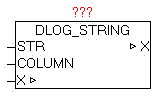

<!--
  Copyright (c) 2026 Hans Mühlbauer, Franz Höpfinger and others.

  This program and the accompanying materials are made available under the
  terms of the Eclipse Public License 2.0 which is available at
  https://www.eclipse.org/legal/epl-2.0

  SPDX-License-Identifier: EPL-2.0
-->

## DLOG_STRING

| | |
|:---|:---|
| **Type	Function module** |  |
| **IN_OUT	X** | DLOG_DATA (DLOG data structure) |
| **INPUT	STR** | STRING (process value) |
| **COLUMN** | STRING (40) (process value name) |
| | The module DLOG_DINT is for logging (recording) of a process value of type DINT, and can only be used in combination with a DLOG_STORE_* module, as this coordinates of the data structure X to record the data. At recording formats that support a process value name, such as at DLOG_STORE_FILE_CSV a name can be provided at COLUMN". |

