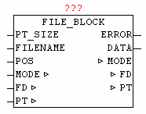
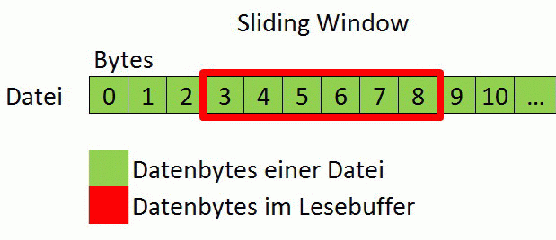

<!--
  Copyright (c) 2026 Hans Mühlbauer, Franz Höpfinger and others.

  This program and the accompanying materials are made available under the
  terms of the Eclipse Public License 2.0 which is available at
  https://www.eclipse.org/legal/epl-2.0

  SPDX-License-Identifier: EPL-2.0
-->

## FILE_BLOCK

| | |
|:---|:---|
| **Type** | Function module |
| **INPUT	PT_SIZE** | UINT (number of bytes in the buffer) |
| **FILE NAME** | STRING (file name) |
| **POS** | UDINT (current file reading position) |
| **OUTPUT** | ERROR: BYTE (error code - See module FILE_SERVER) |
| **DATA** | BYTE   (BYTE of the requested file position) |
| **IN_OUT	MODE** | BYTE (Current mode) |
| **FD** | FILE_SERVER_DATA (File Interface) |
| **PT** | NETWORK_BUFFER (read data) |
| | The module FILE_BLOCK provides access to files of any size by a data block that is always kept in a read buffer. If the requested byte of a file is not stored in last block of data, automatically a matching new data block is read and the desired byte is putted out. The greater the read buffer is the less frequently a block must be read again. Optimally it is a linear access to the bytes, so that as seldom as possible, a data block must be read anew. |
| **Procedure** |  |
| | The Parameter FILENAME specifies the name of the file to be read, and with PT_SIZE the size of the read buffer is specified in bytes. The value for parameter POS is the exact data position within the file, which has to be read. The process is triggered by setting MODE to 1. Then the system automatically checks whether the desired data byte is already in the read buffer. If not, then a new matching block of data is copied into the read buffer, and the desired data byte is passed on the parameter DATA. As long as this operation is not finished yet, MODE remains at 1, and only after completion of the operation of module is reset to MODE = 0. If a specified data position is larger than the current length of the file or the file has length 0, so the output at ERROR is 255 (See ERROR codes from block FILE_SERVER). |
| | If the file access is no longer needed, the user must close the file be either by use of AUTO_CLOSE or MODE 5 (close file) of the FILE_SERVER. |

