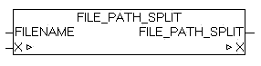

<!--
  Copyright (c) 2026 Hans Mühlbauer, Franz Höpfinger and others.

  This program and the accompanying materials are made available under the
  terms of the Eclipse Public License 2.0 which is available at
  https://www.eclipse.org/legal/epl-2.0

  SPDX-License-Identifier: EPL-2.0
-->

## FILE_PATH_SPLIT

| | |
|:---|:---|
| **Type	Function** | BOOL |
| **INPUT	FILE NAME** | STRING (string_length) |
| **IN_OUT	X** | FILE_PATH_DATA '   (Single path elements) |
| | The module split a file path into its component elements. The drive, path and file name are extracted and stored in the data structure X. As directory separator "\" and "/" will be accepted. If the passed "File name" is not empty and elements can be evaluated, the module returns TRUE, otherwise FALSE. |

**Beispiel:**

Example: c: \folder1\dir2\oscat.txt DRIVE DIRECTORY FILE NAME
