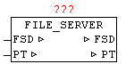

<!--
  Copyright (c) 2026 Hans Mühlbauer, Franz Höpfinger and others.

  This program and the accompanying materials are made available under the
  terms of the Eclipse Public License 2.0 which is available at
  https://www.eclipse.org/legal/epl-2.0

  SPDX-License-Identifier: EPL-2.0
-->

## FILE_SERVER

| | |
|:---|:---|
| **Type** | Function module |
| **IN_OUT	FSD** | FILE_SERVER_DATA (file interface) |
| **PT** | NETWORK_BUFFER (read / write data) |
| | Available platforms and related dependencies |
| **CoDeSys** |  |
| | Does the library "  SysLibFile.lib  " |
| | Runs on |
| | WAGO 750-841 |
| | CoDeSys SP PLCWinNT V2.4 |
| | and compatible platforms |
| **PCWORX** |  |
| | No library required |
| | Runs on all controllers with file system from firmware >= 3.5x |
| **BECKHOFF** |  |
| | The module FILE_SERVER enables hardware and manufacturers a neutral access to the file system of PLC. Since at almost every hardware and software platform, the accessibility to the file system is sometimes very different, it is necessary to use a uniform and simplified functional interface, which is reduced to the necessary functions. The module is hardware-dependent and therefore it must be available for that platform are the appropriate implementation. |
| | WIth FILE NAME the file is determined. Depending on the platform may be slightly different syntax (with or without the path). With MODE parameter the principle of access is given. At MODE 1,2 and 3 with "OFFSET" the position can be specified in the file. In the file system counting is always started with byte 0. The first step is always to check whether this file is already (still) open, and if not they will open and the current file size is observed and passed to the "FILE_SIZE". When specifying a time AUTO_CLOSE > 0ms, the file is automatically closed after each command and the expiration of the waiting time. Alternatively, using MODE = 5, the closing of the file is done manually. Each write command which change the size of the file automatically leads to a corrected "FILE_SIZE" entry, so it is always   visible how large the file is right now. Once a file is open, this is reported on FILE_OPEN = TRUE. |
| | Each write command at which the size of the file changes automatically leads to a corrected "FILE_SIZE" entry, so you can always  how large the file is right now. In PT.SIZE is the actual amount of data automatically corrected or entered. |
| | If the MODE 1,2 or 3 called with PT.SIZE = 0, the file is opened, the FILE_SIZE determined, but no read/write command is performed, and the file will remain open until manually closed or AUTO_CLOSE. |
| | If data has to be written, the data has to be stored in PT.BUFFER and in PT.SIZE the bytes must exist. This data are written to the specified relative offset in the file. If a write mode is called with PT.SIZE = 0, then in turn the file is opened (if not already open, and made no write command, and these will remain open until a manual closing or AUTO_CLOSE is carried out.) |
| | After every executed command that changes the position of the virtual read / write pointer, the current position in the data structure is written in the parameter "OFFSET". An automatic append function can be realized very easy. The parameter FILE_SIZE has to be written to the OFFSET parameter after opening the file. After that, all written bytes are appended to the end without changing the OFFSET parameter manually. The same principle can be applied of course when reading, the read pointer should be positioned first within the file (usually starting at offset 0). |
| | If a command is executed and FILE NAME differs from the current FILE NAME, the old one, still open file, is closed automatically and the new one is opened then, and continued with the normal command. This can easily perform a flying change of the file without having to perform cumbersome and OPEN to CLOSE before. |
| | When you delete a file with MODE 4 automatically a potentially outstanding file is closed before, and then deleted in sequence. |
| | After a AUTO_CLOSE or manual closing by MODE 5 all data in FILE_SERVER_DATA is reseted. |
| | The module FILE_SERVER should always be called periodically, at least as long as not all requests are completed safely. |
| | Since some platforms perform a file-lock (eg CoDeSys) and do not always allow an asynchronous use, FILE_SERVER should run in a separate task so that the default application is not influenced in the time behavior.  . |
| **The FILE_SERVER provides the following commands in "MODE"** |  |
| **ERROR** | Error codes Beckhoff |
| **ERROR** | Error codes PCWORX: |
| **ERROR** | CoDeSys error codes: |

| Development Environment | Target Platform | PLC libraries to include |
| --- | --- | --- |
| TwinCAT v2.8.0 or higher | PC or CX (x86) | TcSystem.Lib |
| TwinCAT v2.10.0 Build >= 1301 or higher | CX (ARM) | TcSystem.Lib |

| MODE | Properties |
| --- | --- |
| 1 | An existing file is opened for reading and reading data optional |
| 2 | An existing file is opened for write access and optional data is written |
| 3 | A file will be created for writing and data will be written optional |
| 4 | Delete file |
| 5 | Close file |

| Value | trigger | Description |
| --- | --- | --- |
| 0 |  | No error |
| 19 | SYSTEMSERVICE_FOPEN | Unknown or invalid parameter |
| 28 | SYSTEMSERVICE_FOPEN | File not found. Invalid file name or file path |
| 38 | SYSTEMSERVICE_FOPEN | SYSTEMSERVICE_FOPEN |
| 51 | SYSTEMSERVICE_FCLOSE | unknown or invalid file handle. |
| 62 | SYSTEMSERVICE_FCLOSE | File was opened with the wrong method. |
| 67 | SYSTEMSERVICE_FREAD | unknown or invalid file handle. |
| 74 | SYSTEMSERVICE_FREAD | No memory for read buffer. |
| 78 | SYSTEMSERVICE_FREAD | File was opened with the wrong method. |
| 83 | SYSTEMSERVICE_FWRITE | unknown or invalid file handle |
| 94 | SYSTEMSERVICE_FWRITE | File was opened with the wrong method. |
| 99 | SYSTEMSERVICE_FSEEK | unknown or invalid file handle. |
| 110 | SYSTEMSERVICE_FSEEK | File was opened with the wrong method. |
| 115 | SYSTEMSERVICE_FTELL | unknown or invalid file handle. |
| 126 | SYSTEMSERVICE_FTELL | File was opened with the wrong method |
| 140 | SYSTEMSERVICE_FDELETE | File not found. Invalid file name or file path. |
| 255 | Application | Position is after the end of file |

| Value | trigger | Description |
| --- | --- | --- |
| 0 |  | No error |
| 2 | File_open | The maximum number of files already open |
| 4 | File_open | The file is already open |
| 5 | File_open | The file is write-protected or access denied |
| 6 | File_open | File name not specified |
| 11 | File_close | Invalid file handle |
| 30 | File_close | File could not be closed |
| 41 | FILE_READ | Invalid file handle |
| 50 | FILE_READ | End of file reached |
| 52 | FILE_READ | The number of characters to read is larger than the data buffer |
| 62 | FILE_READ | Data could not be read |
| It could be read no data | FILE_WRITE | Invalid file handle |
| 81 | FILE_WRITE | There is no memory available to write the data |
| 82 | FILE_WRITE | The count of characters to write is larger than the data buffer |
| 93 | FILE_WRITE | There were no written data |
| 0 | FILE_SEEK | Invalid file handle |
| 113 | FILE_SEEK | Invalid positioning mode or the specified position is before the start of the file |
| 124 | FILE_SEEK | The position could not be set |
| 131 | FILE_TELL | Invalid file handle |
| 142 | FILE_REMOVE | The maximum number of files already open |
| 143 | FILE_REMOVE | The file could not be found |
| 145 | FILE_REMOVE | The file is opened, readonly or access denied |
| 146 | FILE_REMOVE | File name not specified |
| 161 | FILE_REMOVE | File could not be deleted |
| 255 | Application | Position is after the end of file |

| Value | trigger | Description |
| --- | --- | --- |
| 0 |  | No error |
| 1 | SysFileOpen | Error |
| 2 | SysFileClose | Error |
| 3 | SysFileRead | Error |
| 4 | SysFileWrite | Error |
| 5 | SysFileSetPos | Error |
| 6 | SysFileGetPos | Error |
| 7 | SysFileDelete | Error |
| 8 | SysFileGetSize | Error |
| 255 | Application | Position is after the end of file |
