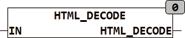

<!--
  Copyright (c) 2026 Hans Mühlbauer, Franz Höpfinger and others.

  This program and the accompanying materials are made available under the
  terms of the Eclipse Public License 2.0 which is available at
  https://www.eclipse.org/legal/epl-2.0

  SPDX-License-Identifier: EPL-2.0
-->

## HTML_DECODE

| | |
|:---|:---|
| **Type	 Function** | STRING(string_length) |
| **Input	IN** | STRING(  String  ) |
| **Output** | STRING(string_length) (string) |
| **HTML_DECODE converts reserved characters which are in the form  &name; stored HTML code, in the original character. In addition, all coded characters are converted into the corresponding ASCII code. Special characters can be represented by the following string in HTML** |  |
| | - &#NN, where NN represents the position of the character within the character map in decimal notation. |
| | - &#xNN, or &#XNN where NN represents the position of the character within the character table in hexadecimal notation. |
| | &name; Special characters have names like &euro; for €. |
| **The reserved characters in HTML are** |  |
| | & Is encoded as &amp; |
| | > Is encoded as &gt; |
| | < Is encoded as &lt; |
| | " is coded as &quot; |

**Beispiel:**

Examples: HTML_DECODE('1 ist &gt;als 0') = '1 is > als 0'; HTML_DECODE('&#D79;&#D83;&#D67;&#D65;&#D84;') = 'OSCAT'; HTML_DECODE('&#xH4F;&#xH53;&#xH43;&#xH41;&#xH54;') = 'OSCAT'; HTML_DECODE('&#XH4F;&#XH53;&#XH43;&#XH41;&#XH54;') = 'OSCAT';
