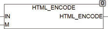

<!--
  Copyright (c) 2026 Hans Mühlbauer, Franz Höpfinger and others.

  This program and the accompanying materials are made available under the
  terms of the Eclipse Public License 2.0 which is available at
  https://www.eclipse.org/legal/epl-2.0

  SPDX-License-Identifier: EPL-2.0
-->

## HTML_ENCODE

| | |
|:---|:---|
| **Type	F  unction** | STRING(string_length) |
| **Input	IN** | STRING(  String  ) |
| **M** | BOOL (mode) |
| **Output** | STRING(string_length) (string) |
| | Html_encode converts in HTML reserved characters to form &Name;. If the input M is set to TRUE also all the characters with the code 160-255 and 128 are implemented in the &Name convention. |
| | Caution should be exercised in the use of character sets because they are not the same on all systems and deviations are common in special characters. Thus, for example, not all systems the € character at position 128 in the character map. |
| **The reserved characters in HTML are** |  |
| | & Is encoded as &amp; |
| | > Is encoded as &gt; |
| | < Is encoded as &lt; |
| | " is coded as &quot; |
| | Html_encode converts the string '1 > than 0 'into '1 is &gt; than 0'. |

