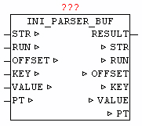

<!--
  Copyright (c) 2026 Hans Mühlbauer, Franz Höpfinger and others.

  This program and the accompanying materials are made available under the
  terms of the Eclipse Public License 2.0 which is available at
  https://www.eclipse.org/legal/epl-2.0

  SPDX-License-Identifier: EPL-2.0
-->

## INI_PARSER_BUF

| | |
|:---|:---|
| **Type** | Function module |
| **OUTPUT** | RESULT: BYTE (result of query) |
| **IN_OUT	STR** | STRING(STRING_LENGTH) (searched item) |
| **RUN** | BYTE (command code for current action) |
| **OFFSET** | UDINT (current file offset of the query) |
| **KEY** | STRING(STRING_LENGTH)  (found item) |
| **VALUE** | STRING (STRING_LENGTH)  (value of a key) |
| **PT** | NETWORK_BUFFER (read data buffer) |
| | The module INI_PARSER_BUF enables the analysis of elements of a INI file stored in a Byte-Array . Before queries can be processed  the user must fill the byte array PT.BUFFER with the ini data, and the number of bytes has to be stored in PT.SIZE. The search for elements always begins on the given depended "OFFSET", and hence is very easy to look only at certain positions, or to repeat the search from a specific section to browse not always the entire byte array. At the initial search should start default to   OFFSET 0 (but may not!). When querying sections  and keys, there are various procedures. Either it is queried to a Section and evaluates all of the following keys by individual queries, or to use in very large initialization file the classic enumeration (listing), which means it will be report serially all the elements, and processed by the application. |
| **Section Search** |  |
| | To determine the OFFSET of a specific Section, STR must declare the name of the Section and the offset can be set to a position that is located before of the searched section. Should only the nearest available section be found, at STR an empty sting must be passed. The search query is started by RUN = 1. The search will take different time, depending on the structure and size of the INI data, it takes an indefinite number of cycles until a positive or negative result is achieved. Once the search is finished, the INI_PARSER_BUF sets the parameters of  RUN to 0. RESULT passes the result of the search to output. Upon successful search the name of the section is shown at parameters KEY. And then the OFFSET parameter points to the end of the section line. Thus, immediately after that the key evaluation can be continued, without having to manually change the OFFSET. |
| **Key Search** |  |
| | Before a Key is evaluated, the OFFSET must have a correct value, this can be done by manual set of OFFSET or by a previously executed Section search. Before running the query at STR the name of the key must be are passed. If an empty string STR is handed over, the next key found is returned. RUN = 2 means the query can be started. Once the search is finished, the INI_PARSER_BUF sets the parameters of  RUN to 0. With RESULT the search results will be issued. When in a query the key identified a new Section, this is reported by RESULT = 11. Upon successful search the output of the parameter KEY is the name of the found key , and VALUE is the key value. And then the OFFSET parameter points to the end of the key line. Thus, immediately after the next Key evaluation be continued, without having to manually change the OFFSET. |
| **Enumeration - see next item** |  |
| | For very large amount of data  of an initialization file to be evaluated, with a enumeration (list) the user program can be build simple, and the evaluation be carried out more quickly because here no line must be used more than once. Before the start OFFSET must have a reasonable value, the default case to 0. With  RUN = 3 the evaluation is started. Once a section or a key is found, it is also issued immediately. In a section KEY prints the name of the Section and RESULT = 1. With a  found KEY, KEY has the key name and VALUE is the key value, and RESULT= 2. |
| | If in   a query, the end of the data array is reached, this will be reported by RESULT = 10. |
| **RUN** | Feature List |
| **RESULT** | Result - Feedback |

| RUN | Function |
| --- | --- |
| 0 | No function to perform - and last function has finished |
| 1 | Specific section or evaluate next found section |
| 2 | evaluate specific Key or Key found next |
| 3 | evaluate next found element (section or key) |

| RESULT | Description |
| --- | --- |
| 1 | Section found |
| 2 | Key found |
| 5 | Current query is still running - call module further cyclical! |
| 10 | Nothing found - reached the end of data |
| 11 | Key not found - reached the end of Section |
