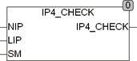
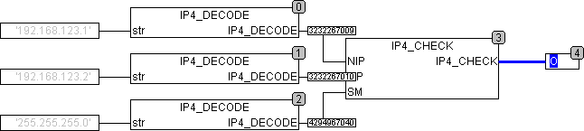

<!--
  Copyright (c) 2026 Hans Mühlbauer, Franz Höpfinger and others.

  This program and the accompanying materials are made available under the
  terms of the Eclipse Public License 2.0 which is available at
  https://www.eclipse.org/legal/epl-2.0

  SPDX-License-Identifier: EPL-2.0
-->

## Type	Function : BOOL

| | |
|:---|:---|
| **Input	NIP** | DWORD (network IP address) |
| **LIP** | DWORD (Local IP address) |
| **SM** | DWORD (  Subnet  Mask) |
| **Output** | BOOL (TRUE if NIP and LIP are in the same  Subnet ) |
| | IP4_CHECK checks if a network address of the NIP and the local address LIP are in the same Subnet  lie. Both addresses will be first masked with the  Subnet  mask and then tested for equality. Only the bits which are in the  Subnet  Mask TRUE are examined for equality. The network addresses must correspond to the IPv4 format and presented as a DWORD. If IP addresses must be tested that are  String they are to be converted to DWORD before. |
| | The following example shows 2 IP addresses and a  Subnet  Mask as  String  are tested after appropriate conversion to DWORD there. The output is TRUE because both addresses are in the same  Subnet . |

