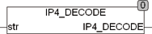

<!--
  Copyright (c) 2026 Hans Mühlbauer, Franz Höpfinger and others.

  This program and the accompanying materials are made available under the
  terms of the Eclipse Public License 2.0 which is available at
  https://www.eclipse.org/legal/epl-2.0

  SPDX-License-Identifier: EPL-2.0
-->

## IP4_DECODE

| | |
|:---|:---|
| **Type	 Function** | DWORD |
| **Input	STR** | STRING(15) (string that contains the IP address) |
| **Output** | DWORD (decoded IP v4 address) |
| | IP4_DECODE decodes the in STR stored string as a IP v4 address and returns it as a DWORD. A return of 0 means an invalid address or an address of '0.0.0.0 ' was evaluated. IP4 may be used for evaluating a  Subnet  Mask of the IP v4 format. |

