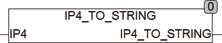

<!--
  Copyright (c) 2026 Hans Mühlbauer, Franz Höpfinger and others.

  This program and the accompanying materials are made available under the
  terms of the Eclipse Public License 2.0 which is available at
  https://www.eclipse.org/legal/epl-2.0

  SPDX-License-Identifier: EPL-2.0
-->

## Type	 Function  : STRING(15)

| | |
|:---|:---|
| **Input	IP4** | BOOL (string that contains the IP address) |
| **Output** | DWORD (decoded IP v4 address) |
| | IP4_TO_STRING converts the IP4 address stored as DWORD in a string. The format is  'NNN.NNN.NNN.NNN'. |

