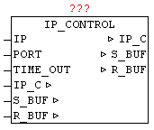

<!--
  Copyright (c) 2026 Hans Mühlbauer, Franz Höpfinger and others.

  This program and the accompanying materials are made available under the
  terms of the Eclipse Public License 2.0 which is available at
  https://www.eclipse.org/legal/epl-2.0

  SPDX-License-Identifier: EPL-2.0
-->

## IP_CONTROL

| | |
|:---|:---|
| **Type** | Function module |
| **IN_OUT	 IP_C** | IP_C (parameterization) |
| **S_BUF** | NETWORK_BUFFER (transmit data) |
| **R_BUF** | NETWORK_BUFFER (receive data) |
| **INPUT	IP** | DWORD (encoded IP address as the default) |
| **PORT** | WORD (port number of the IP address) |
| **TIME_OUT** | TIME (monitoring time) |
| | Available platforms and related dependencies |
| **CoDeSys** |  |
| | requires the library "SysLibSockets.lib" |
| | Runs on |
| | WAGO 750-841
CoDeSys SP PLCWinNT V2.4 |

| | and compatible platforms |
| **PCWORX** |  |
| | No library required |
| | Runs on all controllers with file system from firmware >= 3.5x |
| **BECKHOFF** |  |
| | Requires the installation of "TwinCAT TCP/IP Connection Server"  
Thus requires the Library "TcpIp.Lib" 
 (Standard.lib; TcBase.Lib; TcSystem.Lib are then automatically  included) |

| **Programming environment** | NT4, W2K, XP, Xpe;
	TwinCAT system version 2.8 or higher;
	TwinCAT Installation Level: TwinCAT PLC or higher; 
Target platform:
	TwinCAT PLC runtime system version 2.8 or higher.
	PC or CX (x86)
		TwinCAT TCP/IP Connection Server v1.0.0.0 or higher;
		NT4, W2K, XP, XPe, CE (image v1.75 or higher); |

| | The IP_CONTROL enables manufacturers and platform-neutral use of Ethernet communications. In order to unite the many different interfaces of the PLC-companies that IP_CONTROL is used as an adapter "wrapper" . This module UDP and TCP as well as active and passive connections  can be handled. As in some small controls the number of simultaneous open sockets is very limited, so this module also supports the sharing of sockets. An integrated automatic coordination of requests allows to divide a socket to a number of client devices. Here is automatically recognized whether a client uses a different connection parameters than its predecessor. An existing connection is automatically terminated, and established with the new connection parameters . The type of connection can be set with C_MODE (see table). With C_PORT the desired port number is given, and by the C_IP the IP v4 address. With C_STATE can be determined whether the connection is established - closed, resp. the negative and positive edge on change of state.   C_ENABLE agent will release the connection (establish) or close (removed). The send and receive data works independently of each another, which means it is also possible to send and receive asynchronous such as Telnet. In applications which only send data and no data receive is expected R_OBSERVE must be FALSE, so that no  Timeout  at receive occurs. At the start of transmit and receive activities TIME_RESET is set by the user a to TRUE once, so that all timeout start over with a defined start value. This is required due to the  Sharing functionality, because  established connections remains connected and the access rights are passed here only. The parameter IP serves as a possible  default IP address. To avoid repeating the same IP address parameters, a  Default  - IP can be used. One possible use would be to specify the DNS server address. When the module recognizes as C_IP the IP 0.0.0.0, it automatically uses the default IP address. The same behavior is at the Port parameter. If at the port C_PORT a 0 is detected so the parameterized block port number of the module is used.  The error code ERROR consists of several parts (see table ERROR). With TIMEOUT the overall monitoring time can be specified. This time value is independently used used for connection, send data and receive data. The transferred TIMEOUT value is automatically limited to 200 ms minimum. Thus, this parameter can remain free. |
| | The data block is automatically sent if in a shared connection in the send buffer the transmit data and data length are entered. For data reveice, the data is appended to the already existing data in the buffer. By setting SIZE = 0, the receive data pointer is reset and the next received data is then stored at position 0. 

The module supports the blocking of data messages, that means the S_BUF resp. R_BUF  can be arbitrarily large. Individual received data frames are collected in  R_BUF in   stream form. Just the same when process data are sent. The data in S_BUF is sent individually as  Stream allowed block size. |

| **Application example** | CASE state OF |
| **00** | (* On  Wait for release  *) |
| | IF  RELEASE  THEN |
| **state** | = 10; |
| **IP_STATE** | = 1;  (* Sign on *) |
| | END_IF; |
| **10** | (* Wait for clearance to access for connection and sending content  *) |
| | IF IP_STATE = 3 THEN  (* access permitted? *) |
| | (* IP  set up data traffic *) |
| **IP_C.C_PORT** | = 123;  (* enter port number *) |
| | IP_C.C_IP = IP4;  (* Enter IP *) |
| **IP_C.C_MODE** | = 1;  (* Mode: UDP+ACTIVE+Port+IP *) |
| **IP_C.C_ENABLE** | = TRUE;  (* Release connection *) |
| **IP_C.TIME_RESET** | = TRUE;  (Reset time monitoring * *) |
| **IP_C.R_OBSERVE** | = TRUE;  (* Monitor data receive *) |
| **R_BUF.SIZE** | = 0;  (* Reset  Home length *) |
| | (* Send data register *) |
| **S_BUF.BUFFER[0]** | = BYTE#16#1B; |
| | (* Etc. ... *) |
| **S_BUF.SIZE** | = xx;  (* enter send length *) |
| **state** | = 30; |
| **30** |  |
| | IF IP_C.ERROR <> 0 THEN |
| | (* Perform error analysis *) |
| | ELSIF S_BUF.SIZE = 0 AND R_BUF.SIZE >= xxx THEN |
| | (*  evaluate received data *) |
| | (* Logout - release access for other *) |
| **IP_STATE** | = BYTE#4; |
| **state** | =  0  0;  (* process end *) |
| | END_IF; |
| | END_CASE; |
| | (* IP_FIFO  call cyclic  *) |
| **IP_FIFO(FIFO** | =IP_C.FIFO,STATE:=IP_STATE,ID:=IP_ID); |
| **IP_C.FIFO** | =IP_FIFO.FIFO; |
| **IP_STATE** | = IP_FIFO.STATE; |
| **IP_ID** | =IP_FIFO.ID; |
| **following C_MODE may be used** |  |
| **C_STATE** |  |
| **ERROR** |  |
| **System-specific error** | (PCWorx / MULTIPROG) |
| **System-specific error** | (CoDeSys) |
| **System-specific error** | (Beckhoff) |

| TYPE | TCP / UDP | Aktiv / Passiv | Port number required | IP address required |
| --- | --- | --- | --- | --- |
| 0 | TCP | Active | Yes | Yes |
| 1 | UDP | Active | Yes | Yes |
| 2 | TCP | Passive | Yes | Yes  (Address of the active partner) |
| 3 | UDP | Passive | Yes | Yes  (Address of the active partner) |
| 4 | TCP | Passive | Yes | No  (Any active partner will be accepted) |
| 5 | UDP | Passive | Yes | No  (Any active partner will be accepted) |

| Value | State Message |
| --- | --- |
| 0 | connection is down |
| 1 | Connection has been broken down (negative edge) value exists only for one cycle, then returns 0. |
| 254 | Connection is established (positive edge) value exists for one cycle, then returns 255. |
| 255 | Connection is established |
| <127 | query if connections is established |
| >127 | query if connection is established |

| DWORD | Message Type | Description |
| --- | --- | --- |
| B3 | B2 | B1 | B0 |  |  |
| 00 | xx | xx | xx | Connection establish | Value 00 - No errors found |
| nn | xx | xx | xx | Connection establish | Value 01-252 system-specific error |
| FD | xx | xx | xx | Connection establish | Value 253 - Connection closed by remote |
| FF | xx | xx | xx | Connection establish | value 255 - Timeout Error |
| xx | 00 | xx | xx | Send data | Value 00 - No errors found |
| xx | nn | xx | xx | Send data | Value 01-252 system-specific error |
| xx | FF | xx | xx | Send data | value 255 - Timeout Error |
| xx | xx | 00 | xx | Receive data | Value 00 - No errors found |
| xx | xx | nn | xx | Receive data | Value 01-252 system-specific error |
| xx | xx | FF | xx | Receive data | value 255 - Timeout Error |
| xx | xx | FE | xx | Receive data | Value 254 - Receive buffer is full (overflow) 
(Buffer size is automatically set to 0) |

| xx | xx | xx | nn | Application-  Error | In IP_CONTROL always 00ERROR is transferred originally from the client application and optionally, at this point   an application error is reported. This error code is entered, but only by the client devices. |

| Value | State Message |
| --- | --- |
| 0x00 | No error occurred. |
| 0x01 | Creation of at least one task has failed. |
| 0x02 | Initialization of the socket interface failed (only WinNT). |
| 0x03 | Dynamic memory could not be reserved. |
| 0x04 | FB can not be initialized because at start the asynchronous communication tasks, an error has occurred. |
| 0x10 | Socket initialization failed. |
| 0x11 | Error at sending a message. |
| 0x12 | Error when receiving a message. |
| 0x13 | Unknown service code in the message header. |
| 0x21 | Invalid state transition upon connection. |
| 0x30 | No more free channels available. |
| 0x31 | The connection was canceled. |
| 0x33 | General timeout, receiver or transmitter does not answer or sender has not completed transmission. |
| 0x34 | Connection request has been negatively acknowledged. |
| 0x35 | Recipient did not confirm transfer, possibly overloaded receivers (repeat transfer). |
| 0x40 | Partner-string is too long (255 characters max). |
| 0x41 | The specified IP address is not valid or could not be interpreted correctly. |
| 0x42 | not valid port number. |
| 0x45 | Unknown parameters to input "PARTNER". |
| 0x50 | Transmission attempt on invalid connection (sender or receiver). |
| 0x53 | All available connections are occupied. |
| 0x61 | Neg. confirmation of the recipient. It was used an incorrect sequence number. |
| 0x62 | Data type of transmitter and receiver are not equal. |
| 0x63 | Receiver is at the moment not ready to receive (poss. Cause: The recipient is disabled or is currently in the data transfer (NDR = TRUE). |
| 0x64 | Can not find a receiver module with the corresponding R_ID. |
| 0x65 | Another module instance is already working on this connection. |
| 0x70 | Partner control was not configured as a time server. |

| 0x00 | No error occurred. |
| --- | --- |
| 0x01 | SysSockCreate unsuccessful |
| 0x02 | SysSockBind unsuccessful |
| 0x03 | SysSockListen unsuccessful |

| 0x00 | No error occurred. |
| --- | --- |
| 0x01 | SocketUdpCreate unsuccessful |
| 0x03 | socket listen unsuccessful |
| 0x04 | SocketAccept unsuccessful |
