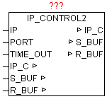

<!--
  Copyright (c) 2026 Hans Mühlbauer, Franz Höpfinger and others.

  This program and the accompanying materials are made available under the
  terms of the Eclipse Public License 2.0 which is available at
  https://www.eclipse.org/legal/epl-2.0

  SPDX-License-Identifier: EPL-2.0
-->

## IP_CONTROL2

| | |
|:---|:---|
| **Type** | Function module |
| **IN_OUT	 IP_C** | IP_C (parameterization) |
| **S_BUF** | NETWORK_BUFFER_SHORT (transmit data) |
| **R_BUF** | NETWORK_BUFFER_SHORT (receive data) |
| **INPUT	IP** | DWORD (encoded IP address as the default) |
| **PORT** | WORD (port number of the IP address) |
| **TIME_OUT** | TIME (monitoring time) |
| | Available platforms and related dependencies |
| | (See module IP_CONTROL) |
| | The block has basically the same functionality as IP_CONTROL. However S_BUF and R_BUF  are of type 'NETWORK_BUFFER_SHORT' 
(See general description IP_CONTROL). 

It is no blocking of the data supported by IP_CONTROL2 . The maximum data size for transmission and reception depends on the hardware platform and is in the range of  < 1500 bytes. This module can always be used when no data stream mode is needed. The primary advantage is that less buffer memory is required, and data will not be copied between internal and external data buffer. Thus, the module is more economical with respect to memory consumption and system load. |

