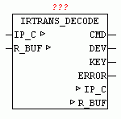

<!--
  Copyright (c) 2026 Hans Mühlbauer, Franz Höpfinger and others.

  This program and the accompanying materials are made available under the
  terms of the Eclipse Public License 2.0 which is available at
  https://www.eclipse.org/legal/epl-2.0

  SPDX-License-Identifier: EPL-2.0
-->

## IRTRANS_DECODE

| | |
|:---|:---|
| **Type** | Function module |
| **I / O	IP_C** | data structure 'IP_CONTROL '   (Parameterization) |
| **R_BUF** | data structure NETWORK_BUFFER_SHORT ' |
| | (Receive data) |
| **Output	CMD** | BOOL (TRUE if valid data are present at the output) |
| **DEV** | STRING (name of the remote control) |
| **KEY** | STRING (name of the key codes) |
| **ERROR** | BOOL (TRUE if a invalid data packet is present) |
| | IRTRANS_DECODE receives the data from the module IRTRANS_SERVER present in BUFFER, checks if a valid data package is available and decodes the name of the remote control and the name of the button form the data packet. If a valid data packet has been decoded, the name of the remote control is passed at the output DEV and the name of the button on the output KEY. The output CMD signals that the new output data are present. The ERROR output is then set when a data packet was received that is not in the correct format. |
| **The format is defined as follows** |  |
| | 'Name of the remote control', 'Name of the key code' $R$N |
| | A data packet consists of the name of the remote control, followed by a comma and then the name of the key codes. The data packet is a completed by Carriage  Return  and a  Line  Feed . |
| | To ensure that IRTRANS_DECODE works in the IRTrans configuration the Check box  BROADCAST IR RELAY must be checked and in the corresponding Device database under the DEFAULT ACTION the  String  '%r%c\r\n' must be registered. IRTRANS_DECODE  evaluates just this String and decodes %r as the name and %c as pressed a button of the remote control. |

