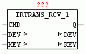
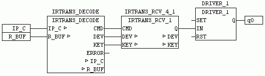

<!--
  Copyright (c) 2026 Hans Mühlbauer, Franz Höpfinger and others.

  This program and the accompanying materials are made available under the
  terms of the Eclipse Public License 2.0 which is available at
  https://www.eclipse.org/legal/epl-2.0

  SPDX-License-Identifier: EPL-2.0
-->

## Type	Function module

| | |
|:---|:---|
| **Input	 CMD** | BOOL (TRUE if data for evaluating are available) |
| **I / O	DEV** | STRING (name of the remote control) |
| **KEY** | string (name of button) |
| **Output	Q** | BOOL (output) |
| | IRTRANS_RCV_1 checkes when CMD = TRUE if the string matches the input DEV corresponds to DEV_CODE (device code) and the string at the input KEY corresponds to the KEY_CODE. If the codes match and CMD = TRUE, then the output Q for a cycle is set to TRUE. |
| **The following example shows the application of IRTRANS_RCV_1** |  |
| | In this example, the receive data buffer to IRTRANS_DECODE is passed. The decoder determines from the valid data packets  String  DEV and KEY and passes them with CMD to IRTRANS_RCV_1. 
IRTRANS_RCV_1 or alternatively IRTRANS_RCV_4 and IRTRANS_RCV_ checks whether DEV and KEY match and then switches the output Q for a cycle to TRUE. in the example  a DRIVER_1 is controlled which enables the remote control to switch the output with each received log. |

| | If multiple  Key  Codes are to be evaluated alternatively the modules IRTRANS_RCV_4 or IRTRANS_RCV_8 can be used or more of these modules can be used in parallel mode. |
| **Setup	DEV_CODE** | STRING (to be decoded remote control name) |
| **KEY_CODE** | STRING (key code to be decoded) |

