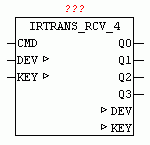

<!--
  Copyright (c) 2026 Hans Mühlbauer, Franz Höpfinger and others.

  This program and the accompanying materials are made available under the
  terms of the Eclipse Public License 2.0 which is available at
  https://www.eclipse.org/legal/epl-2.0

  SPDX-License-Identifier: EPL-2.0
-->

## Type	Function module

| | |
|:---|:---|
| **Input	CMD** | BOOL (TRUE if data for evaluating are available) |
| **I / O	DEV** | STRING (name of the remote control) |
| **KEY** | string (name of button) |
| **Output	Q0..Q3** | BOOL (output) |
| | IRTRANS_RCV_4 checkes when CMD = TRUE if the string matches the input DEV corresponds to DEV_CODE (device code) and the string at the input KEY corresponds to the KEY_CODE. If the codes match and CMD = TRUE, then the output Q for a cycle is set to TRUE. For more information about the function of the device are under IRTRANS_RCV_1. |
| **Setup	DEV_CODE** | STRING (to be decoded remote control name) |
| **KEY_CODE_0..3** | STRING (key code to be decoded) |

