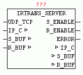
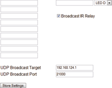
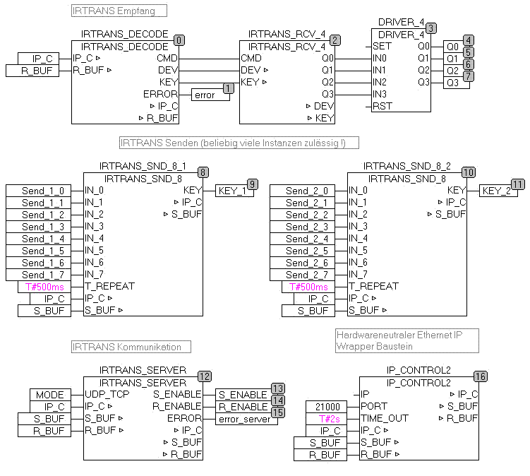

<!--
  Copyright (c) 2026 Hans Mühlbauer, Franz Höpfinger and others.

  This program and the accompanying materials are made available under the
  terms of the Eclipse Public License 2.0 which is available at
  https://www.eclipse.org/legal/epl-2.0

  SPDX-License-Identifier: EPL-2.0
-->

## IRTRANS_SERVER

| | |
|:---|:---|
| **Type** | Function module |
| **Input	UDP_TCP** | BOOL (FALSE = UDP / TRUE = TCP) |
| **In_Out	IP_C** | data structure 'IP_CONTROL '   (Parameterization) |
| **S_BUF** | data structure 'NETWORK_BUFFER_SHORT' |
| | (Transmit data) |
| **R_BUF** | data structure NETWORK_BUFFER_SHORT ' |
| | (Receive data) |
| **Output	S_ENABLE** | BOOL (release IRTRANS data send) |
| **R_ENABLE** | BOOL (IRTRANS data receive enabled) |
| **ERROR** | DWORD (Error code: Check IP_CONTROL) |
| | IRTRANS_SERVER can be used as both a receiver and a transmitter of IRTRANS commands. Is UDP_TCP = TRUE   is a passive TCP connection, otherwise set up a passive UDP connection. The type of operation must also be configured with IRTRANS device. Once a data connection is available and sending commands is allowed, S_ENABLE = TRUE. In UDP mode, after the initial data received from IRTRANS, data can be sent, since in the passive mode, the UDP-IP parameter is initially not known. The receiving mode is indicated with R_ENABLE. If data are received they are available in R_BUF for further processing for other modules. Send data has to be entered by the modules in the S_BUF, so they are then sent automatically from IRTRANS_SERVER. If transmission errors occurs, they are issued with "ERROR" (see module IP_CONTROL2). Existing errors are acknowledged automatically every 5 seconds by the module. |
| **UDP server mode** |  |
| | In the IRTRANS Web configuration, the IP address of the PLC is entered as a broadcast address. |
| **IRTRANS Web Configuration** |  |
| | The following example shows the application of IRTRANS Devices |

