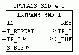

<!--
  Copyright (c) 2026 Hans Mühlbauer, Franz Höpfinger and others.

  This program and the accompanying materials are made available under the
  terms of the Eclipse Public License 2.0 which is available at
  https://www.eclipse.org/legal/epl-2.0

  SPDX-License-Identifier: EPL-2.0
-->

## IRTRANS_SND_1

| | |
|:---|:---|
| **Type** | Function module |
| **Input	IN** | BOOL (TRUE = Send key code) |
| **T_REPEAT** | TIME (time to re-send the key code) |
| **I / O	IP_C** | data structure 'IP_CONTROL '   (Parameterization) |
| **S_BUF** | data structure 'NETWORK_BUFFER_SHORT' |
| | (Transmit data) |
| **Output	KEY** | BYTE (output of the currently active key codes) |
| | IRTRANS_SND_1 allows you to send a remote command to the IRTrans. If IN TRUE the specified device and key code in setup is sent to the IRTrans which outputs in turn as a real remote control commands. With T_REPEAT the repeat time for sending can be specified . If IN remains constant to TRUE so always this key code sent repeated after the time T_REPEAT.   At output KEY in active control  "1" is passed. KEY = 0 means that the IN is not active. |
| **Setup	DEV_CODE** | STRING (to be decoded remote control name) |
| **KEY_CODE** | STRING (key code to be decoded) |

