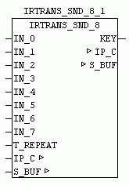

<!--
  Copyright (c) 2026 Hans Mühlbauer, Franz Höpfinger and others.

  This program and the accompanying materials are made available under the
  terms of the Eclipse Public License 2.0 which is available at
  https://www.eclipse.org/legal/epl-2.0

  SPDX-License-Identifier: EPL-2.0
-->

## IRTRANS_SND_8

| | |
|:---|:---|
| **Type** | Function module |
| **Input	IN_0..7** | BOOL (TRUE = Send keycode x) |
| **T_REPEAT** | TIME (time to re-send the key code) |
| **I / O	IP_C** | data structure 'IP_CONTROL '   (Parameterization) |
| **S_BUF** | data structure 'NETWORK_BUFFER_SHORT' |
| | (Transmit data) |
| **Output	KEY** | BYTE (output of the currently active key codes) |
| | IRTRANS_SND_8 allows users to send remote control commands to the IRTrans. If IN_x is TRUE the specified device and key code in setup is sent to the IRTrans which outputs in turn as a real remote control commands. With T_REPEAT the repeat time for sending can be specified . If IN_0 remains constant to TRUE so always this key code sent repeated after the time T_REPEAT. If a change to a different IN_x occures this code will send immediately and then again delayed with T_REPEAT, if it remains a long period of time. At output KEY the currently controlled KEY will be displayed. KEY = 0 means that no  IN_x is active. The values 1-3 are the IN_0 - IN_7. |
| **Setup	DEV_CODE** | STRING (to be decoded remote control name) |
| **KEY_CODE_0..7** | STRING (key code to be sent) |

