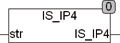

<!--
  Copyright (c) 2026 Hans Mühlbauer, Franz Höpfinger and others.

  This program and the accompanying materials are made available under the
  terms of the Eclipse Public License 2.0 which is available at
  https://www.eclipse.org/legal/epl-2.0

  SPDX-License-Identifier: EPL-2.0
-->

## Type		Function : BOOL

| | |
|:---|:---|
| **Input	STR** | STRING (string to be tested) |
| **Output** | BOOL (TRUE if STR contains a valid IP v4 address) |
| | IS_IP4 checks if the string str contains a valid IP v4 address, if not FALSE is returned. A valid IP v4 address consists of 4 numbers from 0 - 255 and they are separated each with one point. The address 0.0.0.0 is there classified as wrong. |
| | IS_IP4(0.0.0.0) = FALSE |
| | IS_IP4(255.255.255.255) = TRUE |
| | IS_IP4(256.255.255.255) = FALSE |
| | IS_IP4(0.1.2.) = FALSE |
| | IS_IP4(0.1.2.3.) = FALSE |

