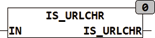

<!--
  Copyright (c) 2026 Hans Mühlbauer, Franz Höpfinger and others.

  This program and the accompanying materials are made available under the
  terms of the Eclipse Public License 2.0 which is available at
  https://www.eclipse.org/legal/epl-2.0

  SPDX-License-Identifier: EPL-2.0
-->

## Type	Function : BOOL

| | |
|:---|:---|
| **Input	IN** | STRING (string to be tested) |
| **Output** | BOOL (TRUE if STR contains a valid IP v4 address) |
| | IS_URLCHR checks if the string contains only valid characters for a URL encoding. If the string contains reserved characters it returns FALSE, otherwise TRUE. |
| **For a URL following characters are valid** |  |
| | [A..Z]
[a..z]
[0..9]
[-._~] |

| | all other characters are reserved or not allowed. |

