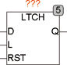

<!--
  Copyright (c) 2026 Hans Mühlbauer, Franz Höpfinger and others.

  This program and the accompanying materials are made available under the
  terms of the Eclipse Public License 2.0 which is available at
  https://www.eclipse.org/legal/epl-2.0

  SPDX-License-Identifier: EPL-2.0
-->

## Type	Function module

| | |
|:---|:---|
| **Input	D** | BOOL (Data in) |
| **L** | BOOL (Latchenable Signal) |
| **RST** | BOOL (asynchronous reset) |
| **Output	Q** | BOOL (Data Out) |
| | LTCH is a transparent storage element (  Latch  ). As long as L is true, Q follows the input D and the falling edge of L stores the output Q the current input signal to D. With the asynchronous reset input of the  Latch  will be deleted at any time regardless of L. |
| | LRSTQSETD |

