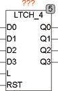

<!--
  Copyright (c) 2026 Hans Mühlbauer, Franz Höpfinger and others.

  This program and the accompanying materials are made available under the
  terms of the Eclipse Public License 2.0 which is available at
  https://www.eclipse.org/legal/epl-2.0

  SPDX-License-Identifier: EPL-2.0
-->

## LATCH4

| | |
|:---|:---|
| **Type** | Function module |
| **Input	D0.. D3** | BOOL (Data in) |
| **L** | BOOL (Latchenable Signal) |
| **RST** | BOOL (asynchronous reset) |
| **Output	Q0 .. Q3** | BOOL (Data  Out  ) |
| | LTCH4 is a transparent storage element ( Latch  ). As long as L is TRUE, Q0 - Q3 follows inputs D0 - D3 and with the falling edge of L the outputs Q0 - Q3 stores the current input signal D0 - D3. With the asynchronous reset input of the  Latch  can be deleted at any time regardless of L. Further explanations and details can be found in the module LTCH. |

