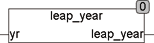

<!--
  Copyright (c) 2026 Hans Mühlbauer, Franz Höpfinger and others.

  This program and the accompanying materials are made available under the
  terms of the Eclipse Public License 2.0 which is available at
  https://www.eclipse.org/legal/epl-2.0

  SPDX-License-Identifier: EPL-2.0
-->

## LEAP_YEAR

| | |
|:---|:---|
| **Type	Function** | BOOL |
| **Input	YR** | INT (year) |
| **Output** | BOOL (TRUE if the specified year is a leap year) |
| | The function LEAP_YEAR tests if the input year is a leap year and passs TRUE if true. The test is valid for the time window from 1970 to 2099. In the year 2100 a leap year is indicated although this is not one. However, since the range of dates according to IEC61131-3 extends only to the year 2106 this correction will be omitted. |

