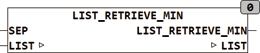

<!--
  Copyright (c) 2026 Hans Mühlbauer, Franz Höpfinger and others.

  This program and the accompanying materials are made available under the
  terms of the Eclipse Public License 2.0 which is available at
  https://www.eclipse.org/legal/epl-2.0

  SPDX-License-Identifier: EPL-2.0
-->

## LIST_RETRIEVE_MIN

| | |
|:---|:---|
| **Type	Function** | STRING(LIST_LENGTH) |
| **Input	SEP** | BYTE (separation sign the list) |
| **I / O	LIST** | STRING(LIST_LENGTH) (input list) |
| **Output** | STRING (String output) |
| | LIST_RETRIEVE_MIN passes the shortest item from a list and deletes the corresponding item in the list. The list consists of   Strings which are separated by the separation character SEP. If several elements with equal length are in the list, the element which is earlier in the string is delivered. |

