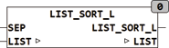

<!--
  Copyright (c) 2026 Hans Mühlbauer, Franz Höpfinger and others.

  This program and the accompanying materials are made available under the
  terms of the Eclipse Public License 2.0 which is available at
  https://www.eclipse.org/legal/epl-2.0

  SPDX-License-Identifier: EPL-2.0
-->

## LIST_SORT_L

| | |
|:---|:---|
| **Type	Function** | STRING(LIST_LENGTH) |
| **Input	SEP** | BYTE (separation sign the list) |
| **I / O	LIST** | STRING(LIST_LENGTH) (input list) |
| **Output** | STRING (String output) |
| **LIST_SORT_L supplies at the output the LIST, but sorted.  The list LIST is emptied here, will the list be further required in original, it must be assigned  to a temporary variable before the call. Shall the list LIST be sorted directly, so the result can again be assigned  (LIST** | = LIST_SORT_L(SEP, LIST). The list consists of   Strings which are separated by the separation character SEP. |

