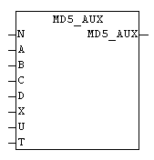

<!--
  Copyright (c) 2026 Hans Mühlbauer, Franz Höpfinger and others.

  This program and the accompanying materials are made available under the
  terms of the Eclipse Public License 2.0 which is available at
  https://www.eclipse.org/legal/epl-2.0

  SPDX-License-Identifier: EPL-2.0
-->

## Type	Function: DWORD

| | |
|:---|:---|
| **Input	N** | INT (internal use) |
| **A** | DWORD (Internal use) |
| **B** | DWORD (Internal use) |
| **C** | DWORD (internal use) |
| **D** | DWORD (internal use) |
| **X** | DWORD (Internal use) |
| **U** | INT (internal use) |
| **T** | DWORD (Internal use) |
| | At the MD5 hash generation several cycles through the complex mathematical calculations which are processed. Thus, the amount of redundant code in the module MD5_STREAM remains small, periodic calculations have been displaced as a macro in the MD5_AUX. This module has only in conjunction with the block MD5_STREAM a useful application. |

