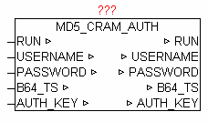

<!--
  Copyright (c) 2026 Hans Mühlbauer, Franz Höpfinger and others.

  This program and the accompanying materials are made available under the
  terms of the Eclipse Public License 2.0 which is available at
  https://www.eclipse.org/legal/epl-2.0

  SPDX-License-Identifier: EPL-2.0
-->

## MD5_CRAM_AUTH

| | |
|:---|:---|
| **Type** | Function module |
| **IN_OUT	RUN** | BOOL (start calculation) |
| **USERNAME** | STRING(64) |
| **PASSWORD** | STRING(64) |
| **B64_TS** | STRING(64) (BASE64 encoded time stamp) |
| **AUTH_KEY** | STRING(192) (BASE64 encoded key) |
| | The module MD5_CRAM_AUTH uses for authentication a request / response mechanism (CRAM Challenge-Response Authentication Mechanism) based on the time stamp of the server and the user's password with the help of the cryptographic checksum function MD5 (message digest 5). The details are described in  RFC 2195  (IMAP/POP Authorize Extension for Simple Challenge/ Response). |
| | A BASE 64 coded time stamp is passed in parameter B64_T. RUN = TRUE, the coding is started. The module calculates from the  Time stamp and the parameter PASSWORD  a checksum and passes it along with the parameters USERNAME  as BASE64 encoded  AUTH_KEY out. After completion of the calculation, RUN = FALSE. |

