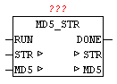

<!--
  Copyright (c) 2026 Hans Mühlbauer, Franz Höpfinger and others.

  This program and the accompanying materials are made available under the
  terms of the Eclipse Public License 2.0 which is available at
  https://www.eclipse.org/legal/epl-2.0

  SPDX-License-Identifier: EPL-2.0
-->

## MD5_STR

| | |
|:---|:---|
| **Type** | Function module |
| **Input	RUN** | BOOL (Positive edge starts the calculation) |
| **Output	DONE** | BOOL (TRUE if calculations are complete) |
| **MD5** | ARRAY[0..15] OF BYTE (current MD5 hash) |
| **I / O	STR** | STRING(string_length) (Text for HASH creation) |
| | With MD5_STR a string of the MD5 hash can be calculated by. In the STR a string is passed to the module, and a positive edge at input "RUN", the calculation starts. DONE is immediately reset at startup, and after the process is DONE is set to TRUE. Then, at the parameter HASH the actual calculated HASH value is available. (See module MD5-STREAM). |

**Beispiel:**

Example: the MD5 hash of 'OSCAT' is  30f33ddb9f17df7219e1acdea3386743
