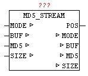

<!--
  Copyright (c) 2026 Hans Mühlbauer, Franz Höpfinger and others.

  This program and the accompanying materials are made available under the
  terms of the Eclipse Public License 2.0 which is available at
  https://www.eclipse.org/legal/epl-2.0

  SPDX-License-Identifier: EPL-2.0
-->

## Type	Function module

| | |
|:---|:---|
| **Output	POS** | UDINT(start address of the requested data block) |
| | The module MD5_STREAM allows the calculation of the MD5  (  Message-Digest Algorithm 5  ) of a cryptographic hash function. |
| | This can be created from any data stream a unique check value. It is virtually impossible to find two different messages with the same test value, this is referred to as collisions free. This can be used to check a configuration file for change or manipulation. |
| | With the hash algorithm (MD5) a hash value is generated from 128 bits in length for any data. The maximum length of the stream is on this module is limited to 2^32 (4 gigabyte). The result is a 16 bytes hash value at parameters MD5. |

I / O	MODE: INT(mode: 1 = init / 2 = Data Block / 3 = Complete) BUF: ARRAY[0..63] OF BYTES (source data) MD5: ARRAY [0..15] OF BYTE (current MD5-HASH) SIZE: UDINT (number of data)

**Beispiel:**

Example: There are 2000 bytes in a buffer and are read using the file system in blocks. User set MODE to 1 and SIZE to 2000. Calling the MD5_STREAM MD5 STREAM performs a initialization and set MODE to 2 and passes at POS the index (base 0) of the desired data. At SIZE  the number of data is set, which are copied into the data memory BUF. User copies the requested data in the BUF and calls the module MD5_STREAM repeatedly. This step is repeated until MODE remains at 2. If the MD5_STREAM has processed the last data block, this set MODE to 3. It can also happen that the last block, that at the SIZE length zero is set, therefore, so no data are copied into BUF . The current hash value can then be processed as a result. Example: the MD5 hash of 'OSCAT' is  30f33ddb9f17df7219e1acdea3386743
