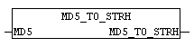

<!--
  Copyright (c) 2026 Hans Mühlbauer, Franz Höpfinger and others.

  This program and the accompanying materials are made available under the
  terms of the Eclipse Public License 2.0 which is available at
  https://www.eclipse.org/legal/epl-2.0

  SPDX-License-Identifier: EPL-2.0
-->

## Type	Function: STRING(32)

| | |
|:---|:---|
| **Input	MD5** | ARRAY[0..15] OF BYTE (MD5-HASH) |
| | The module MD5 MD5_TO_STRH converts the MD5 byte array to a hex string. |

