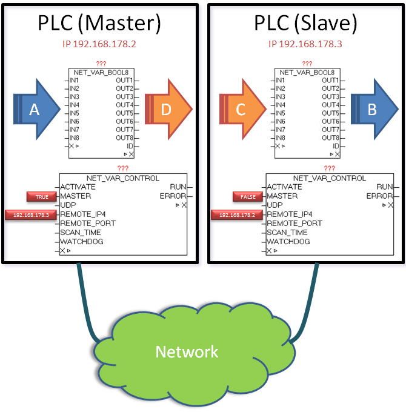

<!--
  Copyright (c) 2026 Hans Mühlbauer, Franz Höpfinger and others.

  This program and the accompanying materials are made available under the
  terms of the Eclipse Public License 2.0 which is available at
  https://www.eclipse.org/legal/epl-2.0

  SPDX-License-Identifier: EPL-2.0
-->

## NET_VAR

The modular package NET_VAR_* enables the bidirectional process data exchange between two controllers on which network.lib is available. Between the two controls a point to point (P2P) connection is established. The process data can by means of the modules NET_VAR_BOOL8
NET_VAR_DWORD
NET_VAR_BUFFER
NET_VAR_STRING
NET_VAR_REAL be collected or passed. Each of these modules has input and output process data which are automatically exchanged with the other party (other plc). IN data on the one side are output as the OUT data on the other side again. In this way process data can be exchanged easily between the same controls but also between different controllers and platforms (WAGO, Beckhoff, Phoenician CONTACT). Approach to the creation of the master module: First all required process data can be parameterized or transferred by means of NET_VAR_* modules instances. Finally, once the NET_VAR_CONTROL must be passed, the process data are then automatically exchanged with the other side. The IP address of the second plc and MASTER = TRUE must be set. Approach to create the slave module: The previously created master device must simply be copied 1:1. The IP address must be replaced by the opposite side, and   be set at MASTER = FALSE.

**Beispiel:**

Example: (See diagram below) The input data (A) from the master PLC will pass through by module NET_VAR_BOOL8 and transferred by NET_VAR_CONTROL to another controller (PLC SLAVE), and then again re-issued at the same NET_VAR_BOOL8 element in the output data (B). The input data (C) from the slave PLC is passed through the module NET_VAR_BOOL8 and transfered by NET_VAR_CONTROL to another controller (PLC master), and then again  re-issued at the same NET_VAR_BOOL8 element in the output data (D).
