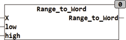

<!--
  Copyright (c) 2026 Hans Mühlbauer, Franz Höpfinger and others.

  This program and the accompanying materials are made available under the
  terms of the Eclipse Public License 2.0 which is available at
  https://www.eclipse.org/legal/epl-2.0

  SPDX-License-Identifier: EPL-2.0
-->

## RANGE_TO_BYTE

| | |
|:---|:---|
| **Type** | Function |
| **Input	X** | REAL (input) |
| **LOW** | REAL  (lower range limit) |
| **HIGH** | REAL (upper limit) |
| **Output** | WORD (output value) |
| | RANGE_TO_WORD converts a REAL value to a WORD value. An input value of X corresponds to the value of LOW is converted it into an output value of 0 and an input value X that corresponds to HIGH is converted to an output value of 65535. The X input is limited to the range from LOW to HIGH, an overflow of the output  WORD   therefore can not happen. |

